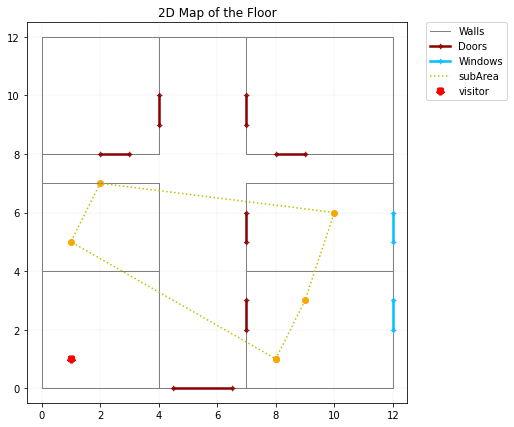
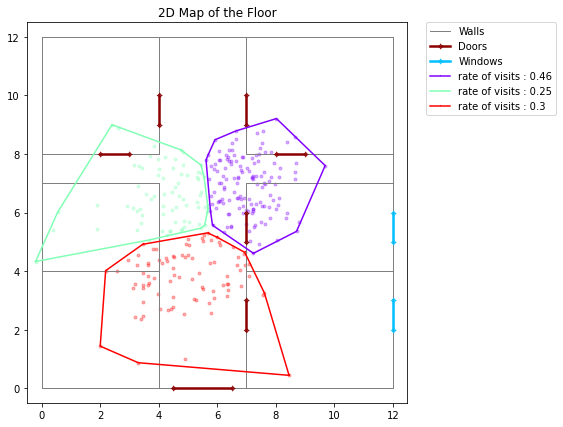

# Digital Twin for Buildings

## Prerequisites 
You need to install `numpy` and `matplotlib`

	$ pip3 install numpy  
	$ pip3 install matplotlib  

## How to recover BUILDING_DIGITAL/ on github :  

Create a directory :   

	$ mkdir git-building-digital  
	$ cd git-building-digital/  

Link to our git : 

	$ git clone https://github.com/yassinhc/Building_digital.git  
	$ cd Building_digital   

Recover tp-hanoi :   

	$ git pull     

## How to run the test

To run the test of src classes you should be in the main directory:

    $ python3 -m unittest test/*

To run the test of build_map you should:

    $ cd building_map/
    $python3 -m unittest tests_library/*

## Content
The repository comprises of:

- ***src*** directory of source files for the main classes used in the project;
- ***test*** directory includes the corresponding tests of the classes in ***src***;
- ***building_map*** directory used to create a 2D map of the building;
- `main.py` file runs a simulation on an example of a building. 

## Scope of Functionalities

### The ***src*** directory

This folder contains the following classes : 
* `Building` : The main class used to create a building 

* `Area` : Abstract class to create the following classes  : 
* `ElementaryArea` : Abstract class used to create the classes : 
* `Room` : an Elemenatary area class to define a room
* `Patio` : an Elementary area class to define a patio
* `SubArea` : Abstract class, used to define more general areas
* `Coordinate` : Class used to create coordinates of Elements
* `Element` : Abstract class used to build the following classes
* `Wall*` : can contain the following Elements: 
* `Door` : an element class to define a door
* `Window` : an element class to define a window

### The ***test*** directory
This folder is create to assert the true work of our src classes

### The ***building_map*** directory
This folder incorporates modules used to create a map for the building. 

In the folder ***library***:
* `generate_element.py` is used as a means of creating elements in a building in a simple way (without having to define coordinates using the `coordinate` class each time) using only a list of 4 coordinates *[x1, y1, x2, y2]*.

*  `drawing.py` is used to plot elements in a floor of a building.

* `convex_hull.py` is used to compute and plot the convex hull of a set of points.  

    * In order to run the example simulation used in this module, you can run the following command in the terminal (from the main directory of the project):
    

    $ python building_map/library/convex_hull.py

* `k_means.py` is used to implement *k*-clusters of a set of points *X* through updating the centroids of the clusters *iter*-number of iterations.

The folder ***tests_library*** contains some unit-tests : 
* `test_convex_hull.py` : tests the functions inside the module *library/convex_hull.py*. 
* `test_k_means.py` : tests the functions inside the module *library/k_means.py*. 

### The *`main.py`* file

This file runs a simulation of a building example. For the sake of simplicity, we created a building comprising 1 floor, which has a width = length = 12. It contains several elements, namely walls, doors, and windows. 

The simulation can be run through the following command ( used in terminal from the main folder of the project) : 

    $ python main.py

Then, the command prompt will ask the user to choose between 3 options : 
* ***Assert if a visitor is within a given subArea***

The *visitor* is generated as a random point on the floor area. The *subArea* is defined through some *walls* (you can redefine the subArea to fit your choices). 

Every time the simulation is run, the visitor’s location is generated randomly, and the program asserts if he exists within the predefined *subArea*. It prints out the result in the form of a string : 

    The visitor is within the subArea? --> False
or

    The visitor is within the subArea? --> True

And plots the 2D plan of the building, with the frame of the *subArea* and the visitor’s location. 

* ***Draw clusters of the floor***

Since the digital twin is not actually connected to real-time sensors to locate visitors in the building, we simulated the visited spots of the floor by some random vector of points within the building’s boundaries. 

The program clusters the points into *k*-clusters (*k* is predefined as *k = 3*). It then plots the 2D plan of the floor with different clusters, specifying the *rate of visits* of each cluster. 

* ***Exit***

to exit the simulation.
